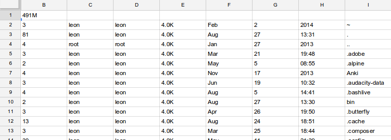

gspreadsheet-bash
=================

google spreadsheet bash client which lets you combine your unix-fu with spreadsheets. Piping/replacing spreadsheet from the console for lazy developers :)

# Usage 
       
    gspreadsheet <export|import> <spreadsheetname> <sheetgid> <type>

    exporttypes: are 'xls' 'csv' 'pdf' 'ods' 'tsv' 'ods' or 'html'

The sheetgid can be found in the googlespreadsheet browserurl.
These urls end with '#gid=123' (so 123 is the sheetgid).

# Example
  
    user=my@email.com pass=googlepasswd gspreadsheet export 'My spreadsheet' 12323
    foo4   bar4
    foo1   bar1
    foo2   bar3

# Example: Search/Replace 

    $ export user="my@email.com"
    $ export pass="owerwer"
    $ gspreadsheet export "My spreadsheet" 123 | sed 's/flip/flop/g' | gspreadsheet import "My spreadsheet" 123

# Example: console fu

    $ export user="my@email.com"
    $ export pass="owerwer"
    $ ls -la | awk '{ for(i = 1; i <= NF; i++) { printf "%s",$i; if( i < NF ) printf "\t" }; printf "\n" }' | gspreadsheet import "My spreadsheet" 123

The awk oneliner converts the usual spacedelimited unix output to tsv (tabseperated fields, the format which our gspreadsheet utility likes).

  

# Todos

* import append instead of delete+upload.

# Requirements

* any linux distro (bash+curl+gawk)
